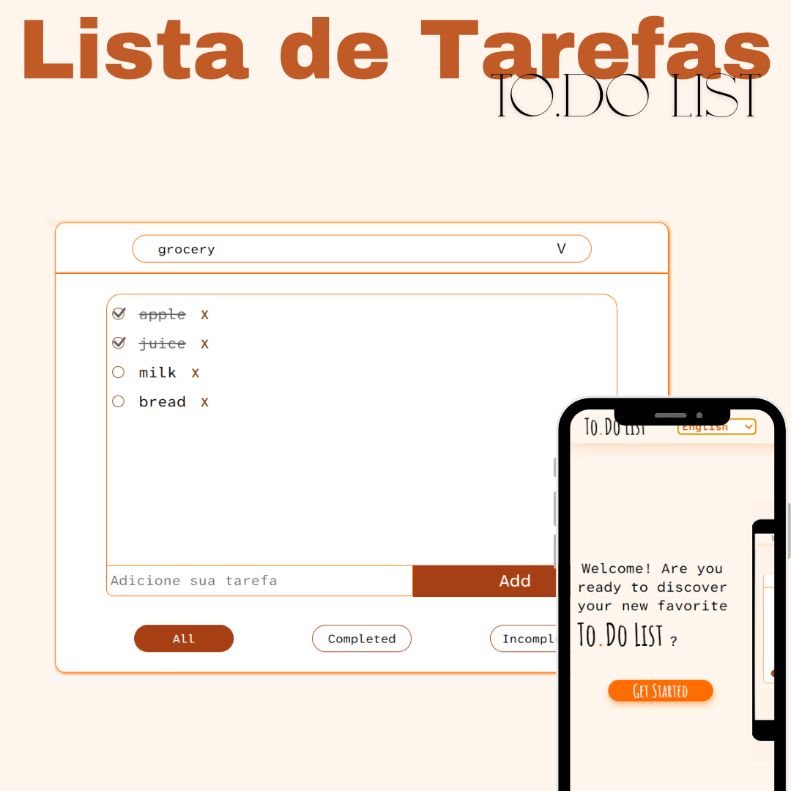

<h1 align="center">📋☑ To.Do List</h1>

## 📲 Acesse / Access

**Contatos / Contacts:**

- [LinkedIn](https://linkedin.com/in/marianabelo26/)
- [Instagram](https://instagram.com/marianabelo.__)
- [Portfólio Web (live)](https://marianabelo.netlify.app/)

---

## 💻 Projeto / Project

### 🖥️ [To.Do List](https://marianabelo26.github.io/todo/#/)

  

Uma lista de tarefas (To-do List) com funcionalidades completas. A aplicação permite criar múltiplas listas personalizadas, além de adicionar tarefas dentro de cada uma delas. É possível marcar tarefas como concluídas, filtrar por status (todas, concluídas ou pendentes) e excluir tanto tarefas quanto listas inteiras.

A To-do List application that allows users to create multiple custom lists and add tasks to each one. Tasks can be marked as completed, filtered by status (all, completed, or incomplete), and both tasks and entire lists can be deleted.

---

## 🚀 Tecnologias / Tech Stack

- HTML5
- CSS3
- React
- JavaScript
- Git & GitHub
- Vite

---

## 📷 Preview

  

---

## 🤝 Conecte-se / Let's connect!

Sinta-se à vontade para me chamar em qualquer rede para conversarmos sobre projetos, freelas ou oportunidades de trabalho.

Feel free to reach out to me on any platform to talk about projects, freelancing, or job opportunities.

---

## 🪪 Autor / Author

**Mariana Belo**  
🌍 Front-end Developer  
📍 Teixeira de Freitas, BA – Brazil  
📧 mariana.belo26@hotmail.com

---
